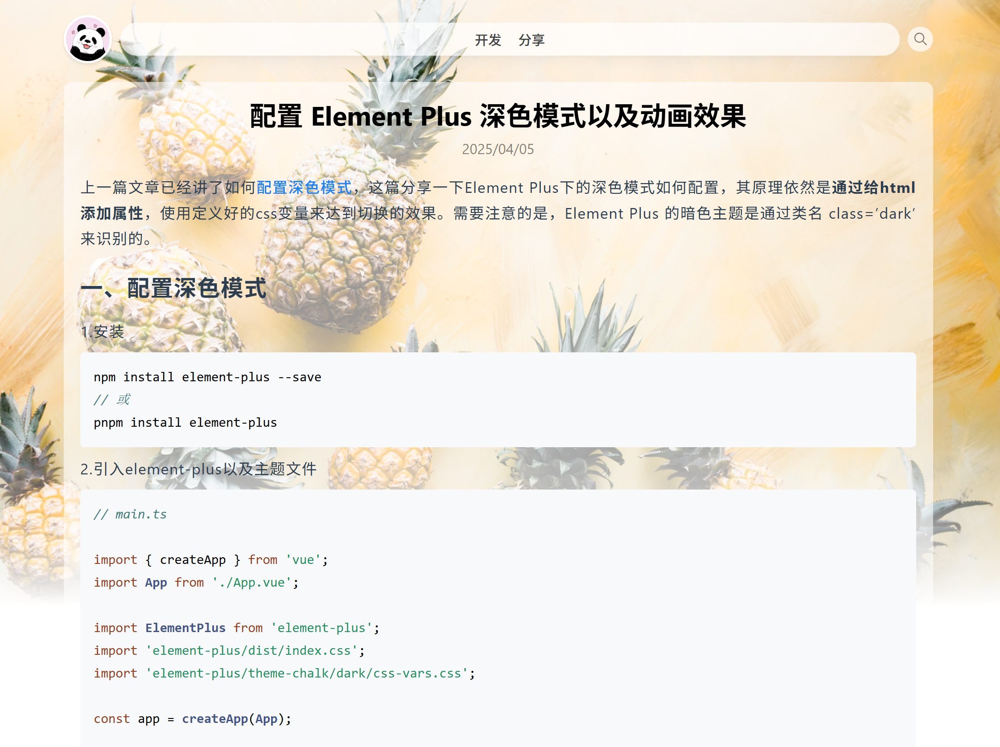

=== biancatheme ===
一个现代、简洁且响应式的 WordPress 主题，适用于博客和内容发布类网站。

== Description ==

- 响应式设计，适配所有设备
- 支持 Gutenberg 编辑器
- 支持特色图片，文章页头部背景展示特色图片
- /code 支持代码高亮
- 支持菜单设置，内容搜索

== Installation ==

1. 上传主题到 `/wp-content/themes/` 目录。
2. 在后台外观 -> 主题中启用该主题。

== Frequently Asked Questions ==

- slogan 暂未动态设置。
- 底部 github 地址暂未动态设置。
- 不支持插件。

== Screenshots ==

1. 首页展示

   

2. 文章页

   
